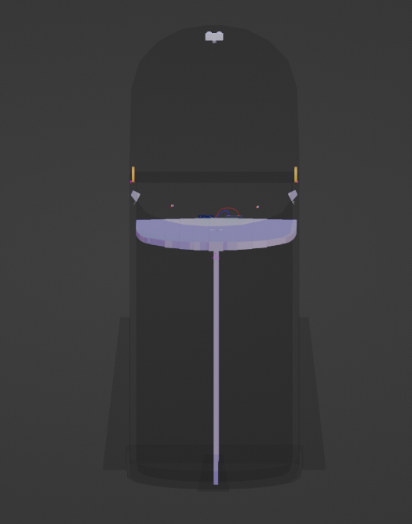
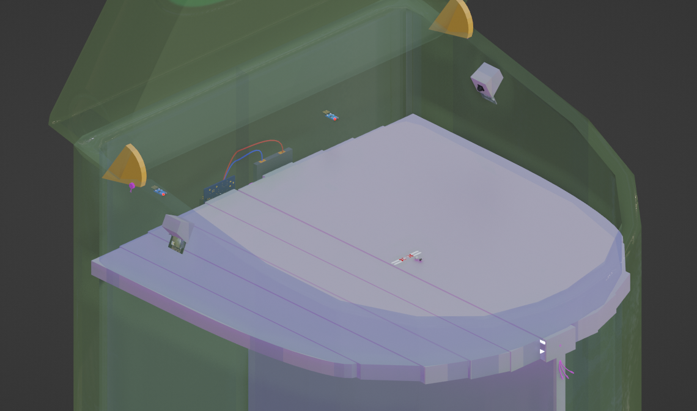
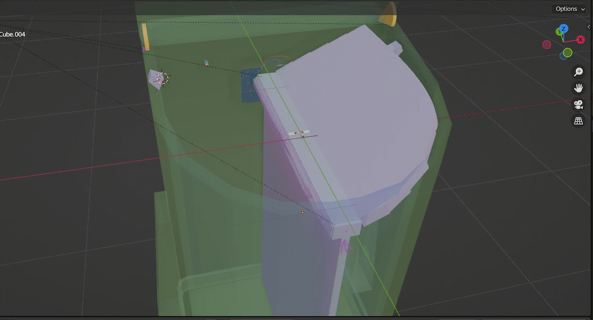
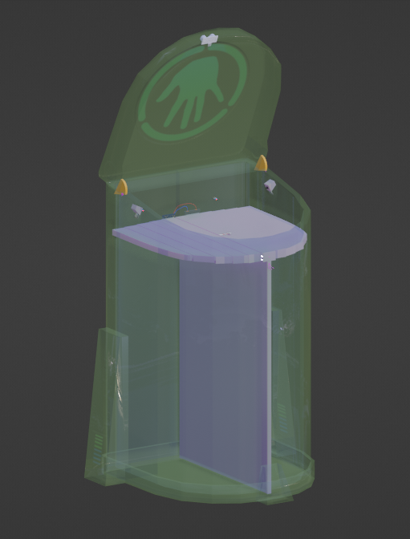
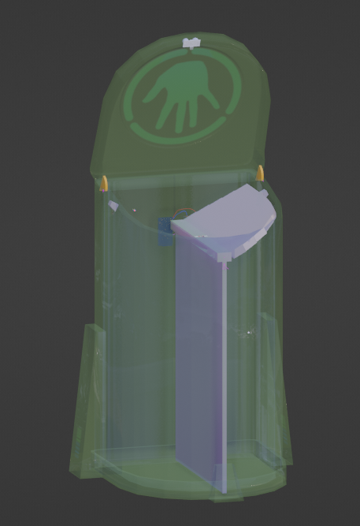

# **SAID**

*SAID** or Segregation Aid architecture, is a proposed solution to the problems revolving around waste segregation. SAID architecture segregates waste at the forefront of waste management, that is waste collection. This eliminates the need to allocate additional resources to segregate waste at the waste collection center.

Waste disposal is often a concern for various reasons including *eutrophication, toxic waste consumption by animals and land, air or water pollution.*

Old architectures of dustbins either requires usage of multiple bins, which allows us to choose the correct dustbin for organic and recycleable waste, but most of the times, its the human error or ignorance that introduces the need for further waste segregation techniques, utilizing more time and captial. This ML algorithm helps SAID dustbin architecture to segregate waste based on image data acquired using lenses equipped within the SAID bin. The waste will be segregated into either of the two categories -

-  ***Organic Waste*** 
-  ***Recyclable Waste*** 

<!-- `Note - ` -->
  **Organic Waste**   *can broadly be classified as **Wet Waste*** &  **Recyclable Waste**    *can be broadly classified as **Dry Waste*** which makes it easier to comprehend what exactly we are trying to segregate.  

# **SAID 3D Demo Model**
 

 
 

